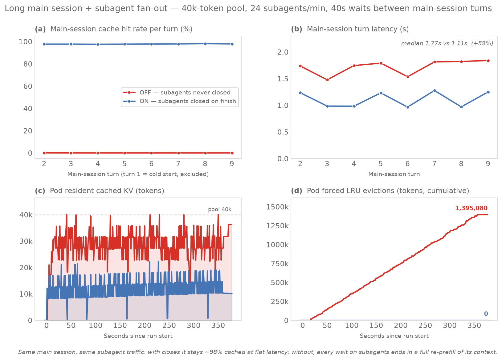

# Micro benchmark: a long main session surrounded by finished subagents

The smallest experiment that shows what explicit `/close_session` (sglang#27058, `--enable-session-radix-cache`) buys the **agentic fan-out pattern**: one long-lived **main session** that repeatedly delegates to **subagents**, waits for them, and appends only their small results to its own context. Each subagent builds a sizable working context (file reads, tool output), returns its answer, and is done — its KV will never be touched again. The question the benchmark answers: does the main session keep a warm prefix and predictable turn latency, or does dead-subagent KV evict it during every wait? Everything needed to reproduce or re-present this is in this folder.



## Result (2026-07-17, GKE `llm-d-session-control`, sglang v0.5.15.post1, Qwen3-32B TP2, 40k-token pool)

One **main session** (~8k-token context, one turn every 40 s — think of the 40 s as time spent blocked waiting on subagents — alive throughout, never closed) shares a pod with a stream of **subagents**: 24 short-lived sessions/min (~4k context, 3 turns, then the subagent has returned its result and is gone). Identical traffic in both arms; the only difference is whether subagent sessions are closed when they finish.

| main session, warm turns (2–9) | ON — subagents closed | OFF — subagents never closed |
|---|---|---|
| cache hit rate | **97.6–98.1% every turn** | **0.0% every turn** |
| turn latency median | 1.11 s | 1.77 s (**+59%**) |
| turn latency worst | 1.28 s | 1.84 s |
| pod forced evictions (6 min) | **0 tokens** | **1,395,080 tokens** |

Mechanism, visible in the bottom row of the figure: in OFF mode the residue of finished subagents keeps the pool pinned near 40k, so every new subagent prefill forces LRU evictions — and during each 40 s wait the main session's prefix is the oldest entry, so it is what gets evicted. Every main-session turn re-prefills ~9k tokens from scratch, even though the only thing it actually needed from the subagents was their few-hundred-token results. ON mode closes each subagent as it finishes, freeing its KV immediately; the pool never fills and the main session's prefix survives every wait.

## What it takes to see the effect (calibration finding)

A first run at gentler settings (25 s waits, 8 subagents/min) showed **no main-session degradation** even though the OFF pod force-evicted 230k tokens: LRU evicts by last access, and the main session — touched every 25 s — was always younger than the dead subagent contexts, so LRU sacrificed those first. The main session only gets hurt when **the subagent traffic completing within one wait window exceeds the pool space it doesn't hold itself** (here: 24/min × 40 s × ~4.8k ≈ 77k tokens vs 40k − 10k = 30k free). That is itself the honest summary of when close_session matters for per-request latency: heavy subagent fan-out while the parent is blocked for a long stretch — which is exactly the normal shape of agentic work. The pool-hygiene benefit (panel d) appears far earlier.

## How to reproduce

1. **Cap the pool** so pressure exists at micro scale — add to `guides/session-control/modelserver/gpu/sglang/base/patch-sglang.yaml` args (and **remove + re-apply when done**; 40k cripples normal use):

```yaml
            - "--max-total-tokens=40000"
```

```bash
kubectl --context $CTX apply -n $NS -k ${REPO_ROOT}/guides/session-control/modelserver/gpu/sglang/gke/
kubectl --context $CTX -n $NS scale deployment/session-control-gpu-sglang-decode --replicas=2
kubectl --context $CTX -n $NS rollout status deployment/session-control-gpu-sglang-decode --timeout=40m
```

The server must also run `--enable-session-radix-cache`, `--radix-eviction-policy=priority`, `--enable-cache-report` (already in the guide's base config).

2. **Stage and run**, one arm per pod (or sequentially with a `flush_cache` between). The metrics sampler is shared and runs inside the pod, streaming a 1 Hz CSV out through `kubectl exec`:

```bash
for pod in <ON-pod> <OFF-pod>; do
  k cp microtrace_main_subagents.py $pod:/tmp/ && k cp sample_metrics.sh $pod:/tmp/
  k exec $pod -- curl -s -X POST localhost:8000/flush_cache
done
k exec <ON-pod>  -- sh /tmp/sample_metrics.sh > pod_metrics_on.csv  &   # leave running
k exec <OFF-pod> -- sh /tmp/sample_metrics.sh > pod_metrics_off.csv &
k exec <ON-pod>  -- python3 /tmp/microtrace_main_subagents.py --url http://127.0.0.1:8000 --mode on  --main-interval 40 --subagent-rate 24 --subagent-context 4000 --duration 360 --out /tmp/main_on.csv
k exec <OFF-pod> -- python3 /tmp/microtrace_main_subagents.py --url http://127.0.0.1:8000 --mode off --main-interval 40 --subagent-rate 24 --subagent-context 4000 --duration 360 --out /tmp/main_off.csv
k cp <ON-pod>:/tmp/main_on.csv main_on.csv && k cp <OFF-pod>:/tmp/main_off.csv main_off.csv
```

For reruns on warm pods: `--salt <new>` (disjoint token content) and `--sid-suffix=_<new>` (closed session ids are tombstoned server-side and can never re-tag KV).

3. **Chart**: `python3 gen_microbench_chart.py` (needs matplotlib/seaborn/pandas, e.g. `pip install -i https://pypi.org/simple matplotlib seaborn pandas`) → `figures/main-vs-subagents.png`.

## Files

- `microtrace_main_subagents.py` — the workload: main-session loop + subagent spawner, per-turn CSV (stdlib only; chat completions with the sglang top-level `session_id` extension field). Design rationale, modeling caveats and knob table: [DESIGN.md](DESIGN.md).
- `sample_metrics.sh` — shared pod-side 1 Hz KV-gauge sampler (`token_usage`, `kv_available`, `kv_evictable`, `evicted_total`); reusable for any experiment on this stack.
- `main_on.csv` / `main_off.csv` — the main session's per-turn record (`t, turn, prompt_tokens, cached_tokens, hit_pct, latency_s`).
- `pod_metrics_on.csv` / `pod_metrics_off.csv` — pod gauges during the run (note: `evicted_total` is a lifetime counter; the chart zeroes it to run start).
- `gen_microbench_chart.py` → `figures/main-vs-subagents.png`.
