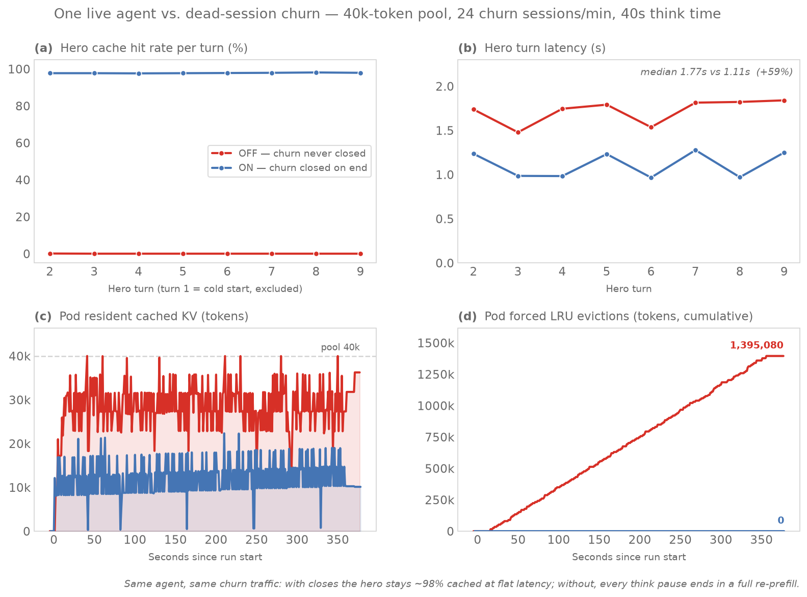

# Micro benchmark: one live agent vs. dead-session churn

The smallest experiment that shows what explicit `/close_session` (sglang#27058, `--enable-session-radix-cache`) buys an **individual live agent**: predictable turn latency and a warm prefix, instead of paying a full re-prefill after every think pause. Everything needed to reproduce or re-present this is in this folder.



## Result (2026-07-17, GKE `llm-d-session-control`, sglang v0.5.15.post1, Qwen3-32B TP2, 40k-token pool)

One **hero** session (~8k-token context, one turn every 40 s, alive throughout, never closed) shares a pod with **churn**: 24 short-lived sessions/min (~4k context, 3 turns, then the agent is done). Identical traffic in both arms; the only difference is whether churn sessions are closed when they end.

| hero, warm turns (2–9) | ON — churn closed | OFF — churn never closed |
|---|---|---|
| cache hit rate | **97.6–98.1% every turn** | **0.0% every turn** |
| turn latency median | 1.11 s | 1.77 s (**+59%**) |
| turn latency worst | 1.28 s | 1.84 s |
| pod forced evictions (6 min) | **0 tokens** | **1,395,080 tokens** |

Mechanism, visible in the bottom row of the figure: OFF-mode churn residue keeps the pool pinned near 40k, so every new churn prefill forces LRU evictions, and during each 40 s think pause the hero's prefix becomes the oldest entry and is evicted — every hero turn re-prefills ~9k tokens from scratch. ON-mode closes free churn KV immediately; the pool never fills and the hero's prefix survives every pause.

## What it takes to see the effect (calibration finding)

A first run at gentler settings (25 s think time, 8 churn/min) showed **no hero degradation** even though the OFF pod force-evicted 230k tokens: LRU evicts by last access, and the hero — touched every 25 s — was always younger than the churn corpses, so LRU sacrificed dead residue first. The hero only gets hurt when **churn arriving within one think window exceeds the pool space not held by the hero** (here: 24/min × 40 s × ~4.8k ≈ 77k tokens vs 40k − 10k = 30k free). That is itself the honest summary of when close_session matters for per-request latency: long agent think time relative to residue turnover. The pool-hygiene benefit (panel d) appears far earlier.

## How to reproduce

1. **Cap the pool** so pressure exists at micro scale — add to `guides/session-control/modelserver/gpu/sglang/base/patch-sglang.yaml` args (and **remove + re-apply when done**; 40k cripples normal use):

```yaml
            - "--max-total-tokens=40000"
```

```bash
kubectl --context $CTX apply -n $NS -k ${REPO_ROOT}/guides/session-control/modelserver/gpu/sglang/gke/
kubectl --context $CTX -n $NS scale deployment/session-control-gpu-sglang-decode --replicas=2
kubectl --context $CTX -n $NS rollout status deployment/session-control-gpu-sglang-decode --timeout=40m
```

The server must also run `--enable-session-radix-cache`, `--radix-eviction-policy=priority`, `--enable-cache-report` (already in the guide's base config).

2. **Stage and run**, one arm per pod (or sequentially with a `flush_cache` between). The metrics sampler is shared and runs inside the pod, streaming a 1 Hz CSV out through `kubectl exec`:

```bash
for pod in <ON-pod> <OFF-pod>; do
  k cp microtrace_hero_churn.py $pod:/tmp/ && k cp sample_metrics.sh $pod:/tmp/
  k exec $pod -- curl -s -X POST localhost:8000/flush_cache
done
k exec <ON-pod>  -- sh /tmp/sample_metrics.sh > pod_metrics_on.csv  &   # leave running
k exec <OFF-pod> -- sh /tmp/sample_metrics.sh > pod_metrics_off.csv &
k exec <ON-pod>  -- python3 /tmp/microtrace_hero_churn.py --url http://127.0.0.1:8000 --mode on  --hero-interval 40 --churn-rate 24 --churn-context 4000 --duration 360 --out /tmp/hero_on.csv
k exec <OFF-pod> -- python3 /tmp/microtrace_hero_churn.py --url http://127.0.0.1:8000 --mode off --hero-interval 40 --churn-rate 24 --churn-context 4000 --duration 360 --out /tmp/hero_off.csv
k cp <ON-pod>:/tmp/hero_on.csv hero_on.csv && k cp <OFF-pod>:/tmp/hero_off.csv hero_off.csv
```

For reruns on warm pods: `--salt <new>` (disjoint token content) and `--sid-suffix=_<new>` (closed session ids are tombstoned server-side and can never re-tag KV).

3. **Chart**: `python3 gen_hero_chart.py` (needs matplotlib/seaborn/pandas, e.g. `pip install -i https://pypi.org/simple matplotlib seaborn pandas`) → `figures/hero-vs-churn.png`.

## Files

- `microtrace_hero_churn.py` — the workload: hero loop + churn spawner, per-hero-turn CSV (stdlib only; chat completions with the sglang top-level `session_id` extension field). Design rationale and knob table: [DESIGN.md](DESIGN.md).
- `sample_metrics.sh` — shared pod-side 1 Hz KV-gauge sampler (`token_usage`, `kv_available`, `kv_evictable`, `evicted_total`); reusable for any experiment on this stack.
- `hero_on.csv` / `hero_off.csv` — the hero's per-turn record (`t, turn, prompt_tokens, cached_tokens, hit_pct, latency_s`).
- `pod_metrics_on.csv` / `pod_metrics_off.csv` — pod gauges during the run (note: `evicted_total` is a lifetime counter; the chart zeroes it to run start).
- `gen_hero_chart.py` → `figures/hero-vs-churn.png`.
