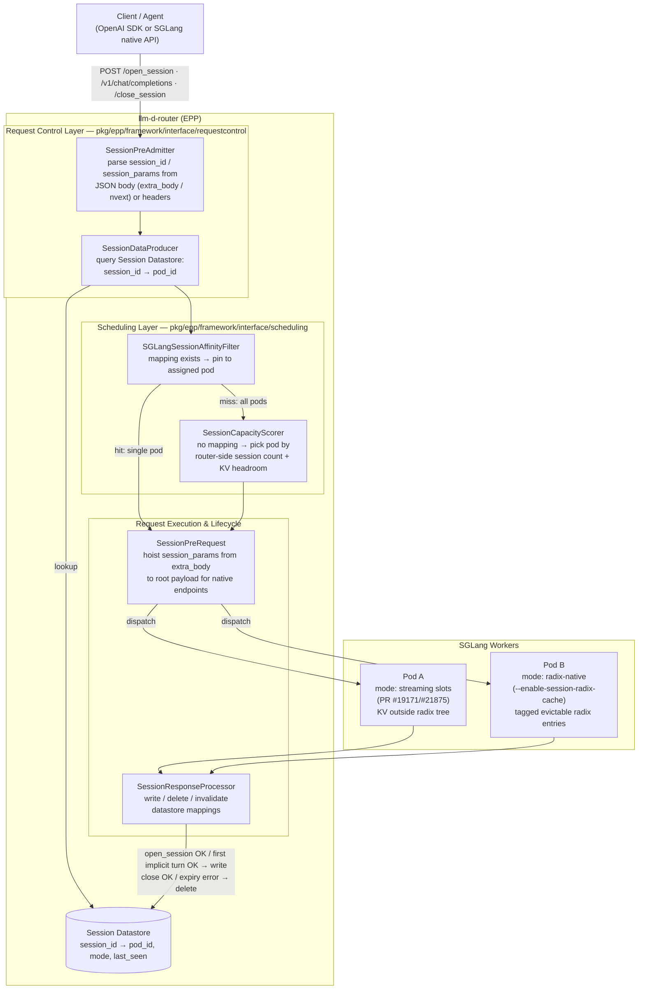
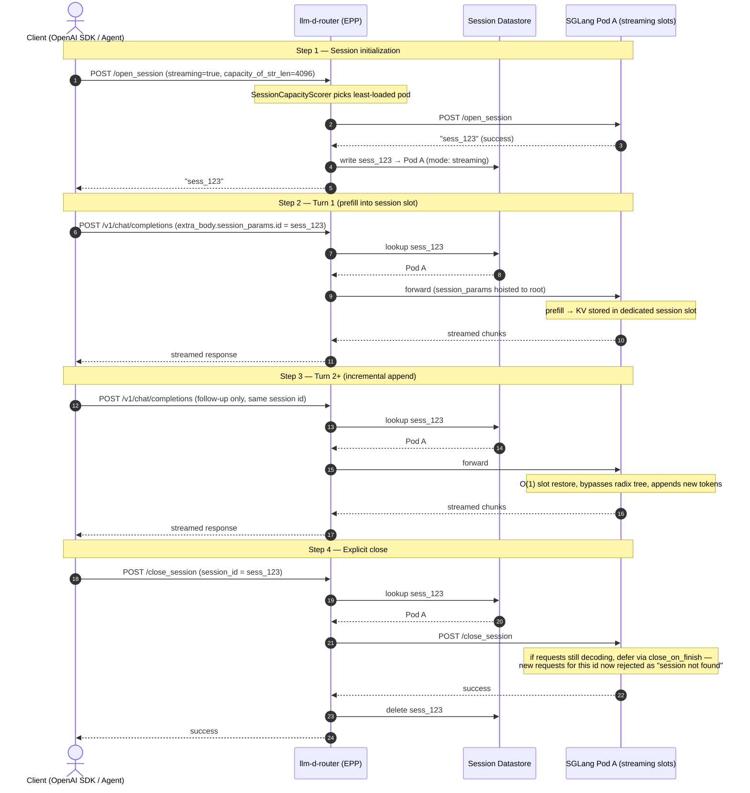
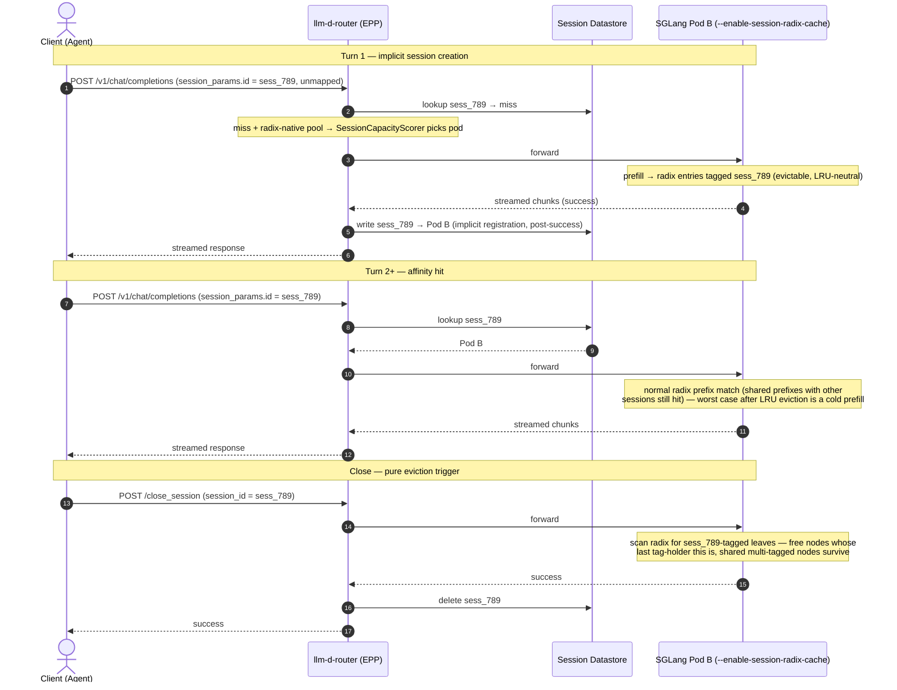

# Design Doc v2: SGLang Session Control Protocol Integration in llm-d-router

Status: Draft v2 — revises v1 to incorporate SGLang PR #27058 (radix-native session mode) as a first-class backend configuration, mode-dependent failover semantics, and edge cases from PR #21875.

## 1. Context & Motivation

Agentic LLM workloads (multi-turn reasoning, tool-calling loops, code execution, and planning subagents) have distinct performance and memory characteristics:

- **Prefix-heavy:** consecutive turns share a growing conversation prefix. KV cache reuse is critical to keep Time-to-First-Token (TTFT) low.
- **Ephemeral state:** subagents spawn briefly, build up a large KV cache, run a tool, and terminate.

Without explicit session control, ephemeral subagent KV cache lives in the standard shared GPU radix tree, causing:

1. **Radix pollution:** short-lived subagent chains compete with and evict the long-lived prefix state of primary agent loops.
2. **Host demotion overhead:** in hierarchical caches (SGLang HiCache), evicting these temporary chains incurs PCIe transfer overhead when demoting to CPU host memory.

SGLang offers **two remedies with opposite trade-offs**, and this design supports both:

| | Streaming session slots (PR #19171) | Radix-native sessions (PR #27058) |
|---|---|---|
| KV placement | Dedicated slots **outside** the radix tree | Ordinary radix entries **tagged** with a session ID |
| Eviction | Invisible to LRU; freed on close/timeout | Standard LRU; close is an eviction trigger |
| Turn-2+ lookup | O(1) slot restore, bypasses radix matching | Normal radix prefix match |
| Cross-session prefix sharing | **Lost** (slots are private) | **Preserved** (multi-tagged nodes freed when last holder closes) |
| Memory pressure risk | Pinned slots can exhaust the pool under concurrent load | None beyond baseline (evictable) |
| Lifecycle | **Explicit** (`/open_session` → turns → `/close_session`) | **Implicit** (first turn with a new session ID creates it; no registration step; bypasses `SessionController`) |

**Trade-off to internalize:** subagent fleets typically share a large system prompt. Streaming slots give per-session isolation and O(1) restore but forfeit that shared prefix; radix-native mode keeps cross-session sharing and better pool utilization (upstream measured 100% → 64% pool occupancy, zero forced cache-thrash evictions vs. 285K tokens in baseline) but offers no eviction protection. The router must route correctly for **both**, plus the passive-affinity baseline.

## 2. Verified Upstream Support

All in open-source `sgl-project/sglang` (no fork required):

- **PR #19171** (merged 2026-02-28): streaming mode with `SessionAwareCache` fast path, `/open_session` / `/close_session` endpoints, incremental KV state inheritance, session timeout reaping. Append-only restrictions: rejects `replace`, `drop_previous_output`, and non-zero `offset`. Measured 1.40–2.47× speedup vs. regular sessions.
- **PR #21875** (merged 2026-04-13): streaming-session stability fixes (open-waiter race, deferred close via `close_on_finish` while requests are decoding, KV leak fixes) and Prometheus gauges `sglang:num_streaming_sessions`, `sglang:streaming_session_held_tokens` — **gated behind `enable_streaming_session`**.
- **PR #27058** (merged 2026-06-23): `--enable-session-radix-cache` — radix-native session tagging as described above. Per-session priority hints deferred to RFC #27574.

Dynamo (`ai-dynamo/dynamo`) provides prior art for the OpenAI-compatible wrapper (`nvext.session_control`) and sticky routing (`StickySessionRouter`); llm-d-router reimplements these as EPP plugins.

## 3. Architecture

The integration spans the Request Control and Scheduling plugin layers of llm-d-router (EPP). All turns for a session are pinned to the same SGLang worker pod. The router is **mode-aware**: backend mode (streaming-slot vs. radix-native) is declared per InferencePool via config and drives session registration and failover behavior.

*(A given InferencePool runs one mode; Pod A and Pod B illustrate both for comparison.)*

### 3.1 Plugin Responsibilities

**A. Request Control Layer** (`pkg/epp/framework/interface/requestcontrol`)

- **SessionPreAdmitter** (`PreAdmitter`): inspects incoming JSON bodies — both SGLang-native formats and OpenAI-compatible `/v1/chat/completions` carrying `session_params` / `session_id` inside `extra_body` / `nvext` — and registers the session identifier on the router's `InferenceRequest` context.
- **SessionDataProducer** (`DataProducer`): query layer between the request execution loop and the Session Datastore.
- **SessionPreRequest** (`PreRequest`): just before forwarding, reshapes the outgoing body for the target worker (e.g., hoists `session_params` from OpenAI `extra_body` to the root payload for native SGLang endpoints).
- **SessionResponseProcessor** (`ResponseHeaderProcessor` & `ResponseBodyProcessor`):
  - `/open_session` success → write `session_id → pod_id` (explicit mode).
  - **First successful turn carrying an unmapped session ID → write the mapping (implicit registration; required for radix-native mode, where no open step exists).** Written only after backend success so a failed first turn doesn't poison the datastore.
  - `/close_session` success → delete the mapping.
  - Session expiry / not-found error → delete the stale mapping so the client can re-initialize. Match on the backend's **error type/message, not status code alone** — the pending-close rejection path (see §5) surfaces as "session not found" and its status code is not contractually pinned upstream.

**B. Scheduling Layer** (`pkg/epp/framework/interface/scheduling`)

- **SGLangSessionAffinityFilter** (`Filter`): if the session ID has a datastore mapping, filter candidates to the assigned pod. If that pod is unhealthy or deleted, behavior is **mode-dependent** (§4.3) — do not silently fall back in streaming-slot mode.
- **SessionCapacityScorer** (`Scorer`): for unmapped sessions (explicit `/open_session`, or an implicit first turn), scores pods by:
  - **Active session count — router-side.** The datastore already knows how many live sessions map to each pod. This is the primary signal because `sglang:num_streaming_sessions` is gated behind `enable_streaming_session` and radix-native sessions bypass `SessionController` entirely, so backend gauges are blind in that mode. Where the backend gauge is available (streaming mode), use it as a cross-check/correction signal.
  - **GPU KV cache headroom:** avoid pods near memory limits (preemption risk in streaming mode; thrash risk in radix-native mode).

## 4. End-to-End Request Lifecycle

### 4.1 Explicit lifecycle — streaming-slot mode (PR #19171)

### 4.2 Implicit lifecycle — radix-native mode (PR #27058)

No `/open_session`. The first `/v1/chat/completions` carrying a new session ID both creates the session on the worker and (on success) the mapping in the router.

### 4.3 Failover — mode-dependent, not uniform

When `SGLangSessionAffinityFilter` finds the assigned pod unhealthy or deleted:

- **Streaming-slot mode: fail fast, do not reroute.** The KV state died with the pod and cannot be recreated elsewhere; a rerouted request hits a pod that has never seen the session and errors with session-not-found anyway. Correct behavior: delete the stale mapping and return a client-facing error instructing the agent to re-open a session (same client contract as timeout reaping, §5).
- **Radix-native mode: reroute is safe.** Sessions are just cache tags; the worst case on a new pod is a cold prefill. The filter returns all candidates, the scorer picks a new pod, and the response processor rewrites the mapping on success.

## 5. Constraints & Edge Cases

**Per-mode constraint matrix:**

| Capability | Standard session | Streaming session (`--enable-streaming-session`) | Radix-native (`--enable-session-radix-cache`) |
|---|---|---|---|
| Backtrack / rewind (`offset` ≠ 0) | ✅ | ❌ rejected | n/a — no session-slot state machine; tags on cache entries only |
| `replace` / `drop_previous_output` | ✅ | ❌ rejected | n/a |
| `/open_session` required | ✅ | ✅ | ❌ none exists |
| Eviction protection | slot-pinned | slot-pinned | none (standard LRU) |
| Backend session gauges | ✅ | ✅ (`sglang:num_streaming_sessions`, `sglang:streaming_session_held_tokens`) | ❌ bypasses `SessionController` — router-side counting only |

**Idle timeout reaping (streaming mode):** SGLang reaps idle sessions after a configured timeout (e.g., 300 s). A request against a reaped session returns a session error; the response processor deletes the stale datastore entry and the client re-initializes. The router should run its own datastore TTL slightly **above** the backend timeout as a leak backstop for entries whose reap error is never observed (client simply stops sending).

**Close-while-decoding race (PR #21875):** if `/close_session` arrives while requests are actively decoding, the worker defers via `close_on_finish` and **rejects new requests for the pending-close session as "session not found."** A client that closes and immediately reuses an ID, or races a final turn against close, hits this path. The response processor must treat it identically to expiry (invalidate mapping, surface re-init error) and must match on error semantics, not a specific HTTP status code.

**Implicit-registration write timing (radix-native):** write the mapping only after the first turn succeeds. Two concurrent first turns with the same new session ID may score to different pods; resolve with first-writer-wins in the datastore and let the loser's KV age out via LRU (harmless in this mode).

**Radix-native session leak backstop:** with no backend reaper for tags in this mode, an abandoned session's KV ages out via LRU naturally, but the **datastore entry** does not — the router-side TTL above is the cleanup path.

## 6. Benchmarking & Validation Roadmap

Automated trace replay across **four** scenarios (v1 had three; radix-native is the headline addition since it targets the same problem with the opposite memory strategy):

1. **Stateless baseline:** round-robin routing, shared radix cache, no session control.
2. **Passive session affinity:** header affinity (`x-session-token`) pinning requests to pods; standard LRU radix eviction on the backend.
3. **Explicit streaming sessions:** `/open_session` + slot-pinned KV + explicit close (PRs #19171/#21875).
4. **Radix-native sessions:** `--enable-session-radix-cache` + implicit lifecycle + affinity routing (PR #27058).

**Key metrics:**

- P95/P99 TTFT on Turn 2+.
- Prefix cache hit rate (%) under parallel multi-turn load — report **cross-session** hits separately, where scenario 4 should beat scenario 3 for subagent fleets sharing a system prompt.
- Maximum concurrent active sessions before GPU cache exhaustion or preemption — where scenario 4's evictable KV (upstream: 100% → 64% pool occupancy) should beat scenario 3's pinned slots.
- Failover behavior under pod kill: error-and-reinit latency (scenario 3) vs. reroute-and-reprefill latency (scenario 4).

**Expected decision guidance:** streaming slots for a bounded number of high-value, latency-critical primary agent loops; radix-native for large fleets of ephemeral subagents with shared prefixes. The router supports both, selected per InferencePool.
