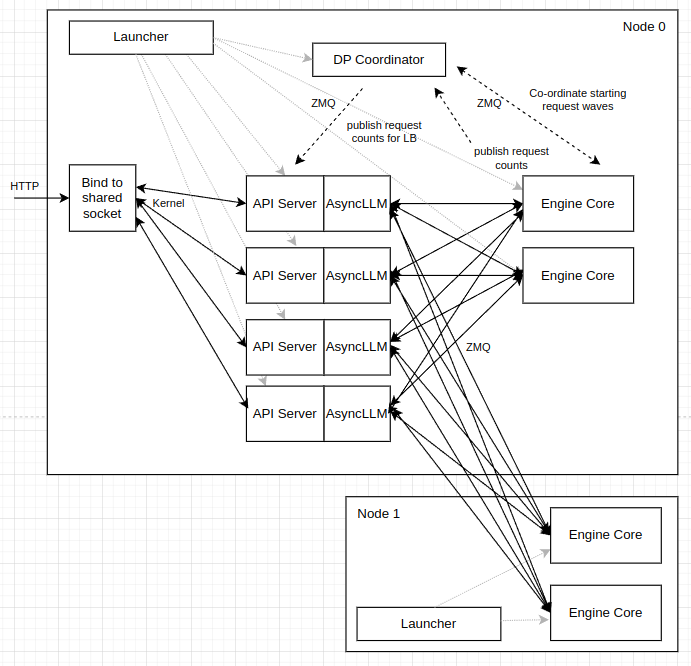
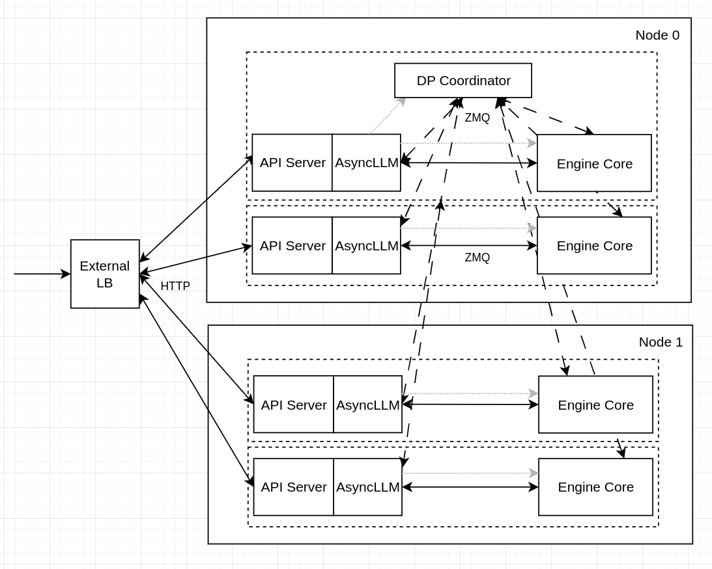

# Experimental: Data Parallel (DP) Aware WideEP Scheduling

This deployment uses **DP-aware scheduling**, where instead of letting vLLM automatically handle data parallelism internally, we explicitly launch separate vLLM server instances for each data parallel rank with a separate port for each rank. This enables the EPP to schedule requests directly to specific DP ranks, improving KV cache routing efficiency.

## Discussion

vLLM supports multiple "modes" for DP load balancing, including:

- **internal**, where vLLM manages DP-balancedness across all ranks. vLLM exposes a single API server endpoint and spreads load between ranks



- **external**, where an external router manages DP-balancedness. Each DP-rank exposes an API server endpoint and the external LB balances between these endpoints



vLLM also has a **hybrid** mode, where a single API server is exposed PER-NODE. An external LB balances BETWEEN nodes and vLLM balances WITHIN a node.

In the context of `llm-d`, we want to use **external** load-balancing, so that the `llm-d` EPP is able to properly schedule requests with prefix-cache awareness, which requires targeting a specific DP-rank rather than a particular node. However, WideEP leverages **DeepEP** for the sparse dispatch/combine operations needed for WideEP. DeepEP uses `cuda_ipc` for intra-node traffic, which cannot cross pod-boundaries so using **one-pod-per-dp-rank** is not an option for WideEP deployments - we need to use **one-pod-per-node**. As a result, we have primarily been using vLLM's **hybrid** DP-load balancing mode - meaning `llm-d`'s EPP is unable to schedule onto specific ranks (only can schedule at the node level), meaning that prefix-cache aware routing features from EPP have been incompatible with WideEP deployments.

### Multi-Port Solution

To overcome this challenge, we instead launch 8 vLLM DP instances (each with a separate API endpoint) within a pod that has 8 visible GPUs (all the GPUs on a node). As a result, **DeepEP** is able to communicate over `cuda_ipc` within the node. Then, we configure the Gateway and InferencePool with **multi-port** support. The Gateway and EPP view each vLLM pod as a collection of 8 separate API endpoints and schedules onto each one of these endpoints directly.

We can, therefore, compose the WideEP deployment with the existing scorers (for example, `prefix-cache-scorer` and `active-request-scorer`) to balance load across the ranks and handle complex multi-turn request patterns.

### Process Management

This deployment uses vLLM's built-in DP Supervisor (`--data-parallel-multi-port-external-lb`), which manages the lifecycle of all DP rank processes within a pod. The supervisor automatically assigns `CUDA_VISIBLE_DEVICES` and `--data-parallel-rank` to each child process, aggregates health checks across all children via a single supervisor endpoint, and handles graceful shutdown.

## Overview

This guide demonstrates how to deploy DeepSeek-R1-0528 using vLLM's P/D disaggregation support with NIXL in a wide expert parallel pattern with LeaderWorkerSets with DP-aware scheduling. This guide has been validated on:

- a 32xH200 cluster with InfiniBand networking (CoreWeave)
- a 32xB200 cluster with InfiniBand networking (CoreWeave)
- a 32xH200 cluster with RoCE networking (GKE)
- Istio 1.29.2 (required for multi-port support in gateway mode)

In this example, we will demonstrate a deployment of `DeepSeek-R1-0528` with:

- 2 DP=8 Prefill Worker
- 1 DP=16 Decode Worker

## Hardware Requirements

This guide requires 32 Nvidia H200 or B200 GPUs and InfiniBand or RoCE RDMA networking. Check `modelserver/base/decode.yaml` and `modelserver/base/prefill.yaml` for detailed resource requirements.

> [!NOTE]
> The pods leveraging inter-node EP must be deployed in a cluster environment with full mesh
> network connectivity. The DeepEP backend used in WideEP requires All-to-All RDMA
> connectivity. Every NIC on a host must be able to communicate with every NIC on all other
> hosts. Networks restricted to communicating only between matching NIC IDs (rail-only
> connectivity) will fail.

## Prerequisites

- Have the [proper client tools installed on your local system](../../../helpers/client-setup/README.md) to use this guide.
- You have deployed the [LeaderWorkerSet controller](https://lws.sigs.k8s.io/docs/installation/)
- Create a namespace for installation.

  ```bash
  export REPO_ROOT=$(realpath $(git rev-parse --show-toplevel))
  source ${REPO_ROOT}/guides/env.sh
  export NAMESPACE=llm-d-wide-ep # or any other namespace (shorter names recommended)
  kubectl create namespace ${NAMESPACE}
  ```

- [Create the `llm-d-hf-token` secret in your target namespace with the key `HF_TOKEN` matching a valid HuggingFace token](../../../helpers/hf-token.md) to pull models.

## Installation

```bash
cd ${REPO_ROOT}/guides/wide-ep-lws/experimental-dp-aware
```

### 1. Deploy the llm-d Router

#### Standalone Mode

This deploys the llm-d Router with an Envoy sidecar, it doesn't set up a Kubernetes Gateway.

```bash
export GUIDE_NAME="wide-ep-lws"
helm install ${GUIDE_NAME} \
    ${ROUTER_STANDALONE_CHART} \
    -f ${REPO_ROOT}/guides/recipes/router/base.values.yaml \
    -f ${REPO_ROOT}/guides/${GUIDE_NAME}/router/${GUIDE_NAME}.values.yaml \
    -n ${NAMESPACE} --version ${ROUTER_CHART_VERSION}
```

<details>
<summary><h4>Gateway Mode</h4></summary>

To use a Kubernetes Gateway managed proxy rather than the standalone version, follow these steps instead of applying the previous Helm chart:

1. *Deploy a Kubernetes Gateway* by following one of [the gateway guides](../../prereq/gateway-provider/README.md).
2. *Deploy the llm-d Router and an HTTPRoute* that connects it to the Gateway as follows:

```bash
export PROVIDER_NAME=gke # options: none, gke, agentgateway, istio
helm install ${GUIDE_NAME} \
    ${ROUTER_GATEWAY_CHART} \
    -f ${REPO_ROOT}/guides/recipes/router/base.values.yaml \
    -f ${REPO_ROOT}/guides/recipes/router/features/httproute-flags.yaml \
    -f ${REPO_ROOT}/guides/${GUIDE_NAME}/router/${GUIDE_NAME}.values.yaml \
    --set provider.name=${PROVIDER_NAME} \
    -n ${NAMESPACE} --version ${ROUTER_CHART_VERSION}
```

</details>

### 2. Deploy the Model Server

Apply the Kustomize overlays for your specific backend:

```bash
export INFRA_PROVIDER=gke # options: gke, coreweave
kubectl apply -n ${NAMESPACE} -k ./manifests/modelserver/${INFRA_PROVIDER}
```

### 3. (Optional) Enable Monitoring

Deploy the monitoring resources for this guide:

```bash
kubectl apply -n ${NAMESPACE} -f ./manifests/modelserver/base/pod-monitors.yaml
```

> [!NOTE]
> This requires the Prometheus Operator CRDs (`PodMonitor`) to be installed on the cluster.

## Verification

Verify the router helm release:

```bash
helm list -n ${NAMESPACE}
```

Check that all pods are running and ready:

```bash
kubectl get pods -n ${NAMESPACE}
```

Expected output (startup takes 7-10 minutes for model loading):

```
NAME                                          READY   STATUS    RESTARTS   AGE
wide-ep-lws-epp-79dfb894f7-fjn8n              2/2     Running   0          5m
wide-ep-llm-d-decode-0                        2/2     Running   0          10m
wide-ep-llm-d-decode-0-1                      2/2     Running   0          10m
wide-ep-llm-d-prefill-0                       1/1     Running   0          10m
wide-ep-llm-d-prefill-1                       1/1     Running   0          10m
```

Decode pods show `2/2` (vLLM + routing proxy sidecar), prefill pods show `1/1`.

### Get the IP of the Proxy

**Standalone Mode**

```bash
export IP=$(kubectl get service ${GUIDE_NAME}-epp -n ${NAMESPACE} -o jsonpath='{.spec.clusterIP}')
```

<details>
<summary><b>Gateway Mode</b></summary>

```bash
export IP=$(kubectl get gateway llm-d-inference-gateway -n ${NAMESPACE} -o jsonpath='{.status.addresses[0].value}')
```

</details>

### Send Test Requests

**Open a temporary interactive shell inside the cluster:**

```bash
kubectl run curl-debug --rm -it \
    --image=cfmanteiga/alpine-bash-curl-jq \
    --namespace="$NAMESPACE" \
    --env="IP=$IP" \
    --env="NAMESPACE=$NAMESPACE" \
    -- /bin/bash
```

**Send a completion request:**

```bash
curl -X POST http://${IP}/v1/completions \
    -H 'Content-Type: application/json' \
    -d '{
        "model": "deepseek-ai/DeepSeek-R1-0528",
        "prompt": "How are you today?"
    }' | jq
```

## Troubleshooting

### Pod Startup Ordering

With 4 pods (2 decode, 2 prefill) requiring inter-node DP coordination, staggered startup can cause cascade failures. If one pod starts significantly before the others, it may timeout waiting for peers and exit cleanly (exit code 0), which triggers the DPSupervisor to shut down all children, causing the other pods to also exit.

If pods are stuck in a restart loop, delete all model server pods at once so they restart simultaneously:
```bash
kubectl delete pods -l llm-d.ai/guide=wide-ep-lws
```

### NCCL Shared Memory

With 8 DP rank processes per pod sharing the `/dev/shm` volume (default 2Gi), NCCL may report "No available shared memory broadcast block" during initialization. This is typically a warning — NCCL falls back to a slower communication path. If pods hang during startup, increase `dshm` `sizeLimit` in the base manifests (e.g., to 16Gi).

## Benchmarking Results

### CKS (4x H200, 32 GPUs, InfiniBand)

Benchmark: `2048_concurrent_2k_isl_2k_osl` (2048 concurrent requests, 2K input / 2K output tokens)

| Metric | Hybrid-LB | DP Supervisor | Change |
|---|---|---|---|
| Output tokens/s | 22,125 | 27,853 | +26% |
| Input tokens/s | 22,586 | 29,329 | +30% |
| Total tokens/s | 44,711 | 57,183 | +28% |
| Requests/s | 11.03 | 14.33 | +30% |

~1,741 output tokens/s per decode GPU (16 decode GPUs), compared to ~1,383 with hybrid-lb.

### GKE (4x H200, 32 GPUs, RoCE)

Benchmark: `2048_concurrent_2k_isl_2k_osl` (2048 concurrent requests, 2K input / 2K output tokens)

| Metric | DP Supervisor |
|---|---|
| Output tokens/s | 23,246 |
| Input tokens/s | 25,106 |
| Total tokens/s | 48,352 |
| Requests/s | 12.27 |

~1,453 output tokens/s per decode GPU (16 decode GPUs). ~17% lower than CKS due to RoCE vs InfiniBand latency.
