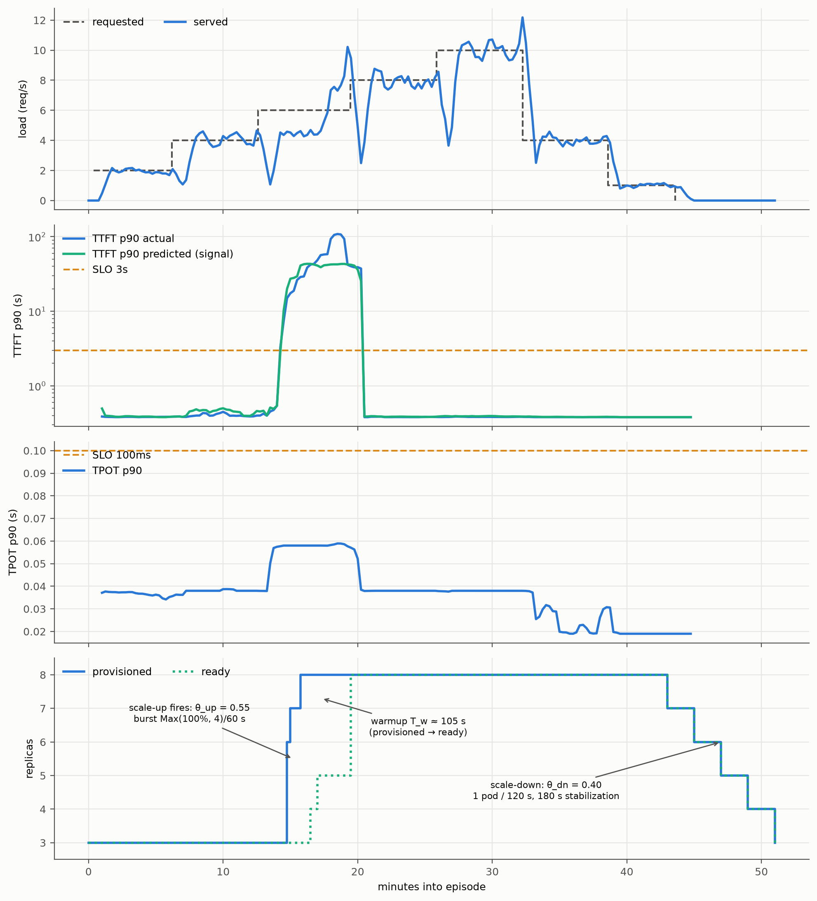

# SLO-Aware Autoscaling with KEDA and Predicted Latency

Autoscale a vLLM inference pool against **latency SLOs** — for example, "keep P90
time-to-first-token under 3 s and P90 time-per-output-token under 100 ms, with as
few GPUs as possible" — using only off-the-shelf components:

- **llm-d-router (EPP)** emits per-request latency histograms —
  the pool's **estimated** P90 TTFT/TPOT, sourced either from the EPP's
  online-trained ML latency predictor (*predicted* latency) or, when that's not
  enabled, aggregated from the actual measured latencies in real time,
- **Prometheus recording rules** turn those into a single saturation signal,
- **KEDA** (with an [expr-lang](https://expr-lang.org/) formula) computes the
  desired replica count and drives a standard HPA.

No custom controller, no CRDs beyond KEDA's ScaledObject. The **control law** —
the rule that maps the current saturation signal to a desired replica count — is
~5 lines of math. The predicted signal reacts a little earlier, but either
source drives the same loop — the guide uses "predicted" throughout because
it's what we benchmarked, but read it as **estimated latency** wherever it
matters.

> [!NOTE]
> **Scope: one variant, one SLO pair.** The recording rules bake in a single
> TTFT/TPOT SLO target and aggregate the EPP's latency histograms pool-wide, so
> this guide assumes **one inference pool serving one model variant against one
> SLO pair**. It does not yet handle multiple variants of the same model (e.g.
> the same model on two accelerator types, or split across separate inference
> pools) or multiple SLO tiers — those would need per-variant recording rules
> and a way to identify the variant at the EPP level. For a
> disaggregated (prefill/decode) deployment, TTFT would drive the prefill pool
> and TPOT the decode pool; adapting the signal chain for that is future work.

## Prerequisites

1. **A running llm-d serving stack.** Follow the
   [optimized-baseline guide](../optimized-baseline) (vLLM inference pool +
   EPP). Then, to feed this autoscaler the *predicted*-latency signal, add the
   **`predicted-latency-producer`** plugin to the EPP's `EndpointPickerConfig`
   (the exact config we benchmarked is in `slo-aware/epp-plugins-configmap.yaml`):

   ```yaml
   plugins:
   - type: predicted-latency-producer
     parameters:
       streamingMode: true
   ```

   *This plugin is optional*: the recording rules below fall back to the EPP's
   **actual**-latency histograms when the predicted series are absent —
   predicted latency just reacts earlier (it rises as pressure builds instead
   of after queueing has already happened).

2. **The EPP's metrics scraped by Prometheus** — this is the whole input to
   the loop; without it the signal is empty and the pool sits at
   minReplicas. The router chart's **`monitoring`** feature wires this up —
   deploy the router with that values file, e.g.:

   ```sh
   helm upgrade <release> $ROUTER_STANDALONE_CHART \
     -f ../recipes/router/base.values.yaml \
     -f ../predicted-latency-routing/router/predicted-latency.values.yaml \
     -f ../recipes/router/features/monitoring.values.yaml \   # <-- exposes port 9090 + ServiceMonitor
     ... -n <ns> --version $ROUTER_CHART_VERSION
   ```

   It exposes the EPP's metrics port (9090) and creates a ServiceMonitor so
   Prometheus discovers it. Verify with
   `kubectl get servicemonitor -n <ns>` and, in Prometheus,
   `up{job=~".*epp.*"} == 1`. Scrape interval ≤ 15 s (we use 5 s) to match
   the 1 m rate windows below.

3. **kube-state-metrics.** The control law reads the target Deployment's
   provisioned and ready replica counts, which kube-state-metrics exposes to
   Prometheus. Any standard install works; if you don't already run it, a
   minimal deployments-only install is in
   [`slo-aware/kube-state-metrics.yaml`](#files).

4. **KEDA** ≥ 2.15 (we ran 2.20.1): `kubectl apply --server-side -f https://github.com/kedacore/keda/releases/download/v2.20.1/keda-2.20.1.yaml`.

## How it works

The recording rules reduce the EPP's latency histograms to a single
**saturation signal** `s` — the pool's P90 TTFT/TPOT as a fraction of your SLO
targets (worst of the two; clamped and smoothed against spikes). The KEDA
formula turns `s` into a desired replica count: **scale up** when `s` crosses
the upper threshold, **scale down** when it falls below the lower one, and hold
steady in the **dead band** between them so the pool doesn't flap. While new
pods are still warming, an **in-flight credit** discounts the ask so one load
step doesn't over-scale to the cap, and the HPA behavior block shapes the
response: burst up fast, drain down slowly. More ready replicas lower per-pod
load, `s` falls back into the band, and the loop settles.

The full control law — the signal chain, the piecewise formula, and why each
asymmetry exists — is derived in
[SLO-Aware Autoscaling with KEDA — the control law](../../docs/architecture/advanced/autoscaling/slo-aware-keda.md).

## Deploy

The manifests ship with our example names — **adjust them to your cluster
before applying:**

- in `slo-aware/scaledobject.yaml`: the target Deployment
  (`optimized-baseline-nvidia-gpu-vllm-decode`), its namespace
  (`llm-d-optimized-baseline`), and the Prometheus address
  (`prometheus-server.monitoring.svc:80`) — in the `scaleTargetRef` and the
  three trigger queries;
- in `slo-aware/prometheus-rule.yaml`: the SLO targets (3 s TTFT / 100 ms TPOT)
  if yours differ, the `namespace` (it ships in the workload namespace
  `llm-d-optimized-baseline`, not `monitoring` — the rules belong to the tenant
  they scale), and the `labels` so your Prometheus's `ruleSelector` picks it up.

```sh
kubectl apply --server-side -f https://github.com/kedacore/keda/releases/download/v2.20.1/keda-2.20.1.yaml   # see APIService caveat above
kubectl apply -f slo-aware/kube-state-metrics.yaml            # skip if you already run KSM
kubectl apply -f slo-aware/prometheus-rule.yaml               # recording rules (match its labels to your ruleSelector)
kubectl apply -f slo-aware/scaledobject.yaml
```

The recording rules ship as a Prometheus Operator `PrometheusRule` in the
workload namespace. For the operator to load it, its namespace must match your
Prometheus's `ruleNamespaceSelector` and its labels your `ruleSelector` (see the
file's comment for how to inspect both). The recorded series are global in
Prometheus either way — the namespace choice is about ownership, not metric
isolation (one rule-set per Prometheus for now — see the **Scope** note above).
On a plain (non-operator) Prometheus, merge its `spec.groups` into your
`rule_files` config and reload instead.

The moment the ScaledObject is created, KEDA's HPA owns the Deployment's
replica count: an idle pool drains to `minReplicaCount`.

**Recommended — fast pod warmup.** Pod-ready time is about half the scale-up
transient, so shortening it is the highest-leverage tuning after the control
law itself. Apply the warmup patch to your decode Deployment (cuts pod-ready
from ~2 m 15 s to ~100 s):

```sh
kubectl -n <serving-namespace> patch deploy <decode-deployment> \
  --type=strategic --patch-file slo-aware/decode-warmup-patch.yaml
```

## Tunables

Start from the benchmarked values and adjust by symptom:

| Symptom | Knob (where) | Benchmarked value | Direction |
|---|---|---|---|
| Wrong latency targets for your workload | $`S_{ttft}, S_{tpot}`$ SLO targets (recording rules) | 3000 ms / 100 ms | Set to your SLOs — the signal is latency ÷ SLO, so everything else scales with these |
| SLO is on a different tail (e.g. median vs P99) than the signal | latency quantile (recording rules) | P90 (`histogram_quantile(0.9, …)`) | Match the quantile in your SLO; higher = more sensitive to outliers |
| Pool stays scaled up long after a brief spike passes | $`C`$ clamp (recording rules) | 2.0 | Lower it (must stay above θ_up) so one spike can't inflate the moving average |
| Replica count jitters on noisy samples / reacts too slowly to real load steps | smoothing window (recording rules) | 45 s | Lengthen to calm jitter; shorten to react faster |
| Scale-up fires only after the SLO is already breached | $`\theta_{up}`$ scale-up threshold (formula) | 0.55 | Lower it to fire earlier on the pre-knee rise |
| Pool over-provisions under healthy load (SLO close to base latency) | $`\theta_{up}, \theta_{dn}`$ band (formula) | 0.55 / 0.40 | Raise both — healthy saturation sits higher when there's little headroom |
| Pool flaps between scale-up and scale-down | $`\theta_{up} - \theta_{dn}`$ gap (formula) | 0.15 | Widen the dead band |
| Floor too low for your traffic base / cap hit at peak | min/max replicas (ScaledObject) | 3 / 8 | Raise to fit your traffic floor and budget ceiling |
| Big load steps outrun the scale-up / drain sheds so fast it re-triggers | HPA behavior (ScaledObject) | up max(100 %, 4)/60 s; down 1/120 s | Raise the up burst; slow the down rate |
| SLO violations concentrated during pod warmup | pod-ready time (Deployment) | ~100 s with [`decode-warmup-patch.yaml`](slo-aware/decode-warmup-patch.yaml) | Shorten warmup — highest-leverage fix; see **Deploy** above |

## What it looks like

On H100 (Qwen3-32B, TP=2), staged ramp 2→10→1 rps, bounds 3–8, the loop
averages **95.8 % combined SLO attainment at 5.93 average replicas** across
repeated runs (a static pool sized for peak is 100 % at 8). One episode is
plotted below; the annotations trace each governing parameter to the behavior
it produces — trigger, burst, warmup, drain.



The pool holds at the floor while healthy, bursts to the cap when the signal
crosses `θ_up`, then drains a pod at a time once load falls. When residual
violations appear they cluster at the first capacity crossing, where a load step
lands on an under-provisioned pool before the new pods finish warming — the
structural cost of any reactive-signal + slow-actuation loop; the episode
plotted caught one such crossing. Full methodology and breakdown:
[`benchmark-templates/BENCHMARK.md`](slo-aware/benchmark-templates/BENCHMARK.md).

## Files

| File | What |
|---|---|
| `slo-aware/` | the autoscaler: kube-state-metrics, recording rules (the saturation signal), ScaledObject (control law + HPA behavior), and the recommended `decode-warmup-patch.yaml`. KEDA itself installs from its upstream release (see Prerequisites). |
| `slo-aware/epp-plugins-configmap.yaml` | the EPP plugin config we ran, incl. `predicted-latency-producer` |
| `slo-aware/benchmark-templates/` | reusable benchmark harness: methodology (`BENCHMARK.md`), [llm-d-benchmark](https://github.com/llm-d/llm-d-benchmark) workload profiles for the burn-in and scored episodes, and the plot+score script |
| `slo-aware/benchmark-results/` | our run's output: episode plots and the scored numbers |

## Revert

```sh
kubectl delete -f slo-aware/scaledobject.yaml    # hands replica control back to you immediately
# if another external-metrics adapter (e.g. prometheus-adapter) was displaced
# by the KEDA install, re-apply its APIService, or just remove KEDA:
kubectl delete -f https://github.com/kedacore/keda/releases/download/v2.20.1/keda-2.20.1.yaml -f slo-aware/kube-state-metrics.yaml
```

Before touching a shared cluster, snapshot anything you overwrite —
`kubectl get apiservice v1beta1.external.metrics.k8s.io -o yaml > /somewhere`
and your Prometheus/EPP ConfigMaps — so you can restore them.
