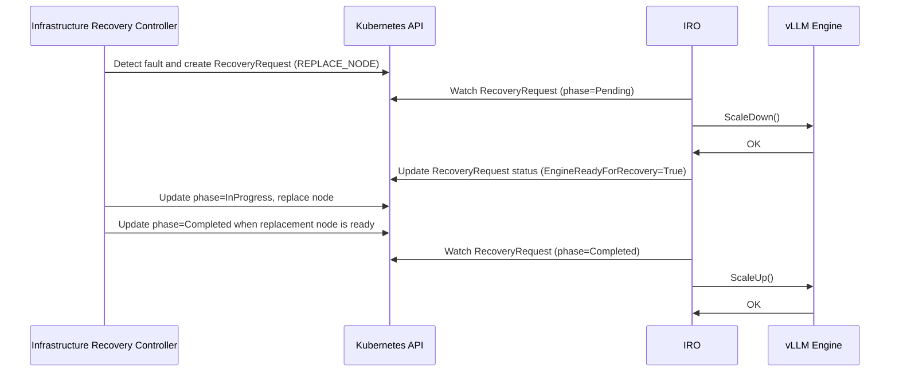

# Inference Resilience Operator (IRO): automated hardware fault recovery for wide-EP deployments

## Summary

Add a new Kubernetes-native component to llm-d - the Inference Resilience
Operator (IRO) - that automatically coordinates hardware fault events with the
inference engine, sequencing the right engine-side response and
infrastructure-side recovery action to minimize serving interruption and restore
full capacity without manual intervention.

## Motivation

Production llm-d deployments running wide Expert Parallelism across multiple
nodes face a class of hardware failures that no existing component handles
end-to-end. When a hardware fault occurs - an accelerator error, a NIC failure,
a kernel panic - two things must happen in a specific order: the inference engine
must be told to stop routing traffic to the affected rank and drain in-flight
requests, and the infrastructure layer must execute the appropriate recovery
action (reset the device, reboot the node, or replace the node entirely).

These two concerns are completely decoupled today. Infrastructure fault detection
agents can cordon and drain nodes but have no awareness of the inference engine
running on them. The inference engine detects internal failures and exposes
recovery APIs but has no awareness of what the infrastructure layer is doing. No
component coordinates between them.

The consequence is a choice between two bad outcomes: the engine crashes and the
entire instance restarts with minutes of full downtime and all in-flight requests
dropped, or an operator is paged to manually sequence the recovery steps.

Every vLLM fault tolerance RFC published in the past few months - [#27866](https://github.com/vllm-project/vllm/issues/27866),
[#27774](https://github.com/vllm-project/vllm/issues/27774), [#27908](https://github.com/vllm-project/vllm/issues/27908), [#20323](https://github.com/vllm-project/vllm/issues/20323), and [#28243](https://github.com/vllm-project/vllm/issues/28243) - explicitly assumes an external orchestrator
will own this coordination. None of them build it. IRO is that component.

### Goals

- Automatically coordinate engine-side response and infrastructure-side recovery
  for hardware faults, without manual operator intervention.
- Match recovery action to fault severity - a transient device error must not
  trigger the same engine response as a node replacement.
- IRO's sole responsibility is engine coordination, with a strong sequencing
  guarantee: IRO acts on the engine before or in parallel with infrastructure
  recovery, and resumes the engine only once infrastructure recovery is confirmed
  complete. The sequencing contract between the two layers is the core value.
- The infrastructure recovery controller owns all fault-to-action mapping and
  operator override logic. IRO trusts the resolved action it receives.
- Restore full serving capacity automatically after infrastructure recovery
  completes.
- Work identically across GKE, EKS, bare-metal, and on-premises deployments.
- Work with any inference engine (initially focusing on vLLM) via swappable adapters.

### Non-Goals

- IRO does not perform fault detection. It consumes signals from existing
  infrastructure agents.
- IRO does not decide what recovery action to take for a given fault code, and
  does not provide an operator policy override mechanism. Both belong to the
  infrastructure recovery controller.
- IRO does not execute cloud-provider-specific recovery actions directly. It
  coordinates the engine while the infrastructure recovery controller executes
  the action.
- IRO does not handle planned node maintenance or lifecycle events in v1.
- IRO does not implement general cluster autoscaling. IRO scales the inference
  serving group only in response to hardware faults, never in response to load.

## Proposal

IRO sits between the infrastructure layer and the inference engine. When a
hardware fault occurs, the "infrastructure recovery controller" creates a
`RecoveryRequest` CRD (a new CRD introduced by this proposal) carrying the
resolved recovery action. IRO watches `RecoveryRequest`, coordinates the
engine-side response, and restores serving capacity once infrastructure
recovery completes.

```
┌──────────────────────────────────────────────────────────────────────┐
│                        Infrastructure layer                          │
│     Cloud agents · on-prem monitors · hardware fault detectors       │
│                  Infrastructure recovery controller                  │
└───────────────┬──────────────────────────▲───────────────────────────┘
                │ RecoveryRequest CRD      │ RecoveryRequest status
                │ (write)                  │ (read)
┌───────────────▼──────────────────────────┴───────────────────────────┐
│                 Inference Resilience Operator (IRO)                  │
│                                                                      │
│  ┌──────────────────────────────┐  ┌─────────────────────────────┐   │
│  │     InferenceReconciler      │  │      Rank topology map      │   │
│  │       state machine          │  │  nodeName + deviceID → rank │   │
│  └──────────────────────────────┘  └─────────────────────────────┘   │
│                                                                      │
│                                                                      │
│  ┌────────────────────────────────────────────────────────────────┐  │
│  │        vLLM EngineAdapter (implements EngineAdapter interface) │  │
│  │                  Discovers vLLM API server                     │  │
│  │            HTTP client → vLLM service endpoint                 │  │
│  │               ZMQ SUB → vLLM fault notify port                 │  │
│  └───────────────────┬───────────────────────▲────────────────────┘  │
└──────────────────────┼───────────────────────┼───────────────────────┘
                       │ HTTP to engine        │ ZMQ fault events
                       │ API server            │
┌──────────────────────▼───────────────────────┴───────────────────────┐
│                          Inference engine                            │
│                  API server · ClientSentinel · EngineCore            │
└──────────────────────────────────────────────────────────────────────┘
```

The "infrastructure recovery controller" in this context is a cloud provider
specific or vendor specific component (e.g., a GKE node repair daemon, or a custom
controller) that watches for hardware errors, then creates a `RecoveryRequest` CR in
Kubernetes. The infrastructure recovery controller owns the fault-to-action
mapping and all operator override logic for the infrastructure layer. IRO trusts
`requestedAction` on `RecoveryRequest` as the final decision and coordinates the
engine-side response accordingly. IRO will ship a reference implementation of the
infrastructure recovery controller but the interface is open to any Kubernetes
provider.

Engine recovery tracks are inferred from `requestedAction` on `RecoveryRequest`:

- **RESET_DEVICE → Track A**: pause engine, reset device, resume engine (seconds)
- **REBOOT_NODE → Track B**: pause engine, reboot node, resume engine (minutes).
  For long reboots where serving at reduced capacity is preferable, operators can
  configure the infrastructure recovery controller to use REPLACE_NODE instead.
- **REPLACE_NODE → Track C**: pause engine, scale down, replace node, scale up
  (many minutes; serves at reduced capacity during replacement)

All engine-specific logic is encapsulated in swappable `EngineAdapter`
implementations. The vLLM adapter is the initial implementation, targeting the
fault tolerance and elastic EP APIs being developed in RFC #27866 / PR #34833,
RFC #28243, and RFC #20323.

### User Stories

#### As an inference platform team running wide-EP in production

I can trust that when a single node in my serving group experiences a hardware
fault, IRO will automatically coordinate with the inference engine, trigger the
appropriate infrastructure recovery action, and restore full capacity once
recovery completes - without my team being paged or manually intervening.

#### As an infrastructure provider or cloud vendor

I can integrate my fault detection agent with llm-d by writing an infrastructure
recovery controller that creates `RecoveryRequest` CRDs, populating `errorCode`
and `requestedAction` based on my hardware knowledge and any operator-configured
overrides. My controller does not need to know which inference engine is running
or call any engine-specific API - IRO handles that entirely.

#### As an inference engine team

I can integrate with IRO by implementing the published `EngineAdapter` interface,
without modifying IRO's core recovery logic. My engine's specific API surface is
entirely encapsulated in the adapter.

## Design Details

### Infrastructure Provider-IRO Interface (CRD)

IRO is dependent on a new CRD that infrastructure recovery agents are expected to
produce. The infrastructure recovery controller creates `RecoveryRequest` when it
detects a hardware fault on a node running an inference workload. IRO watches it,
coordinates engine recovery, and tracks infrastructure recovery completion via it.

**RecoveryRequest** (created by infrastructure recovery controller, consumed by IRO):

- `nodeName`
- `deviceID` (optional)
- `errorCode` (optional, carried for observability — IRO does not interpret it)
- `requestedAction` (RESET_DEVICE | REBOOT_NODE | REPLACE_NODE — resolved by the
  infrastructure recovery controller before creation)
- `status.phase` (Pending | InProgress | Completed | Failed — written by the
  infrastructure recovery controller; IRO watches for Completed to resume the engine)
- `status.conditions[EngineReadyForRecovery]` — optional; see open question below

### IRO-Inference Engine Interface (EngineAdapter)

The EngineAdapter interface exposes operations mapped to the fault tolerance and
elastic EP APIs being developed in the vLLM RFCs (PR #34833, RFC #28243, RFC #20323).
The exact operations and their mapping to engine APIs are subject to refinement as
those APIs stabilize.

| EngineAdapter Operation | vLLM API | RFC / PR | Status |
| :--- | :--- | :--- | :--- |
| **FaultEvents** | ZMQ `vllm_fault` PUB | RFC #27866 / PR #34833 | Draft PR |
| **EngineStatus** | `GET /fault_tolerance/status` | RFC #27866 / PR #34833 | Draft PR |
| **PauseEngine** | `POST /fault_tolerance/apply {pause}` | RFC #27866 / PR #34833 | Draft PR |
| **ResumeEngine** | `POST /fault_tolerance/apply {retry}` | RFC #27866 / PR #34833 | Draft PR |
| **ScaleDown(new_world_size)** | `handle_eep_event {SCALING_REQUEST}` to API server | RFC #28243 | Proposed |
| **ScaleUp(new_world_size)** | `handle_eep_event {SCALING_REQUEST}` + NOTIFICATION to rank 0 | RFC #28243 | Proposed |

### Dual input channels

IRO receives fault signals from two independent directions with distinct,
non-overlapping responsibilities:

- **RecoveryRequest** (infrastructure-initiated) — the primary input channel. IRO
  coordinates the full engine recovery sequence: pause or scale down engine, coordinate
  with infrastructure recovery, then resume or scale up the engine once
  `RecoveryRequest.status.phase` reaches Completed state.
- **Engine fault events via ZMQ** (engine-initiated) - when the engine's internal
  fault monitoring pushes a fault notification with no corresponding
  `RecoveryRequest`, the fault is treated as transient and engine-internal. IRO
  tells the engine to retry without triggering any infrastructure recovery action.

### Sequence of events



### Open question: should infrastructure recovery gate on IRO?

The `EngineReadyForRecovery` condition on `RecoveryRequest` is designed to be
**optional**. This is the key open design question.

**Without gating** - the infrastructure recovery controller creates
`RecoveryRequest` and immediately proceeds with the recovery action. IRO
independently watches `RecoveryRequest`, pauses the engine on the remaining
healthy ranks, and resumes once phase reaches Completed. Because PauseEngine and
ScaleDown only need to talk to the surviving ranks, IRO can act in parallel with
infrastructure recovery even if the faulted chip is already gone. This is simpler
and has no coordination overhead.

**With gating** - the infrastructure recovery controller creates `RecoveryRequest`
with `EngineReadyForRecovery: False` and waits for IRO to set it to True before
acting. This provides a stronger guarantee: the engine is in a clean paused state
before the chip is touched. This may be required if vLLM cannot handle a rank
disappearing mid-collective without hanging.

**The deciding factor** is vLLM's behavior when a rank disappears suddenly: if
PR #34833's internal fault detection catches and handles a sudden rank loss
gracefully (pausing the remaining ranks automatically), gating adds overhead for
no benefit. If vLLM hangs waiting for the dead rank until IRO intervenes, gating
is necessary.

We will be seeking input from the vLLM team on this before finalizing the
coordination contract. The `RecoveryRequest` CRD is designed to support both
models - the condition is present if the infrastructure recovery controller opts
in to gating, absent if not.

For more details, please refer to the [WIP design doc](https://docs.google.com/document/d/1q4V2CcWMSrufy5LJE_Fv49kwCoFoPSTrBrrayzNxRqY/edit?usp=sharing).

## Alternatives

### Extend an existing infrastructure agent

Infrastructure agents have hardware domain knowledge but no inference engine
awareness. Adding engine coordination to an agent would create a reverse
dependency - infrastructure code depending on inference engine APIs - and would
need to be duplicated per cloud provider. The coordination layer should be
cloud-agnostic and engine-agnostic by construction.

### Build recovery logic into the inference engine (vLLM)

Each vLLM fault tolerance RFC explicitly defers recovery orchestration to an
external orchestrator. Adding recovery logic into vLLM itself would tightly
couple hardware recovery to a specific engine, making it unavailable for other
engines and requiring infrastructure knowledge to live in the model server.

### Extend other existing controllers (such as LWS)

LWS is responsible for pod group lifecycle - creating, scheduling, and restarting
groups of pods as a unit. Adding IRO's responsibilities to LWS would conflate pod
lifecycle management with inference engine coordination in a single component, and
would require LWS to grow awareness of hardware fault signals and engine-specific
APIs. IRO instead treats LWS as one actuation target it coordinates alongside the
other layers.
